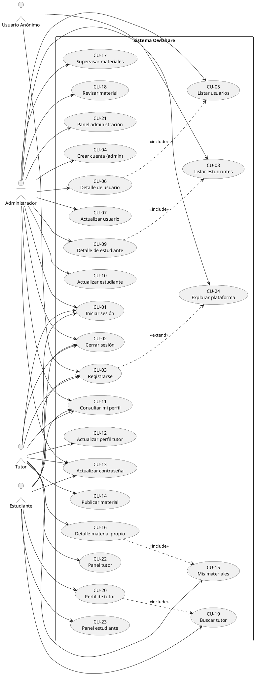
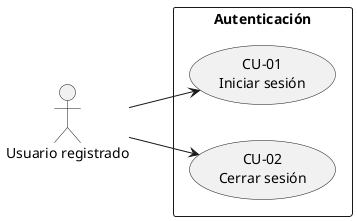
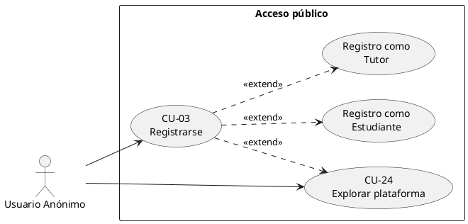
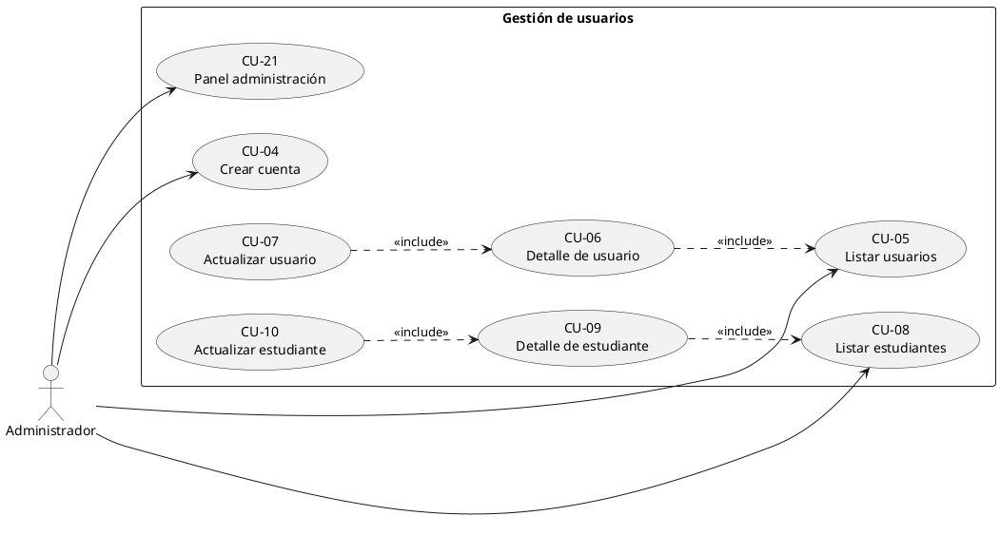
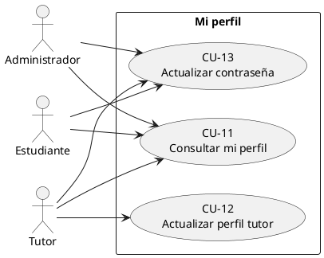
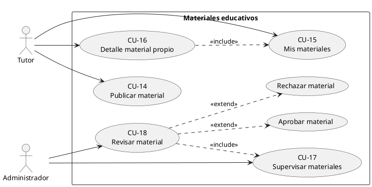
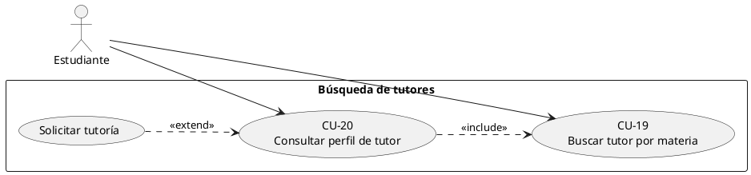
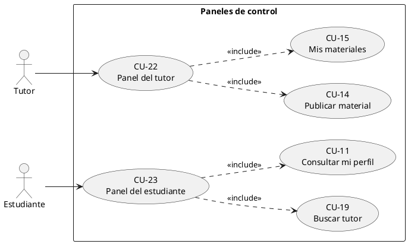

# ESPECIFICACIÓN DE REQUISITOS DE SOFTWARE
## OwlShare

| Atributo | Valor |
| --- | --- |
| Título del Proyecto | OwlShare |
| Tipo de Documento | Especificación de Requisitos de Software (SRS) |
| Versión | 1.0 |
| Fecha de Emisión | "Junio 2, 2026" |
| Estatus | Aprobada para Revisión Académica |
| Normativa | "IEEE 29148:2018, IEEE 830:1998, ISO/IEC 25010:2023" |

## 1. INTRODUCCIÓN

### 1.1 Propósito
Este documento especifica los requisitos funcionales y no funcionales del sistema.
El propósito es documentar las capacidades que el sistema deberá proporcionar, las características de calidad que deberá cumplir y los criterios de aceptación para el desarrollo e implementación del producto.

### 1.2 Descripción General del Producto
OwlShare es una plataforma académica web que facilita la conexión entre estudiantes de pregrado y tutores académicos (estudiantes de semestres superiores).
El sistema proporciona funcionalidades para la búsqueda de tutores especializados, la comercialización de materiales educativos (tareas, guías, exámenes de práctica) y la gestión integral de usuarios con diferentes roles administrativos.
El producto está dirigido a comunidades académicas universitarias que requieren facilitar el apoyo tutorial entre pares y monetizar contenidos educativos.

### 1.3 Audiencia del Documento
Este documento va dirigido a:
* Arquitectos de software y líderes técnicos
* Desarrolladores de software
* Ingenieros de aseguramiento de calidad
* Gestores de proyectos
* Stakeholders del proyecto académico

### 1.4 Referencias Normativas
* IEEE 29148:2018 - Processes for Engineering a System with Related Documentation
* IEEE 830:1998 - Recommended Practice for Software Requirements Specifications
* ISO/IEC 25010:2023 - System and Software Quality Models
* ISO/IEC 27001:2022 - Information Security Management System Requirements
* Jakarta Servlet 6.0 Specification
* Hibernate ORM 6.6 Documentation

## 2. ALCANCE

### 2.1 Límites del Sistema
El sistema OwlShare incluye las siguientes funcionalidades:

**Dentro del Alcance:**
* Gestión de cuentas de usuario con roles diferenciados (Administrador, Tutor, Estudiante)
* Registro y validación de perfiles académicos
* Búsqueda y visualización de tutores especializados por materia
* Subida y gestión de materiales educativos con flujo de aprobación administrativo
* Control de acceso basado en roles
* Persistencia de datos académicos en base de datos relacional
* Interfaz web responsiva

**Fuera del Alcance:**
* Procesamiento de pagos y transacciones monetarias
* Videoconferencias o comunicaciones síncronas
* Aplicación móvil nativa
* Integración con sistemas académicos externos (SIA, SIMOE)
* Foro de preguntas y respuestas
* Notificaciones en tiempo real

### 2.2 Actores del Sistema

| Actor | Descripción |
| --- | --- |
| Administrador del Sistema | "Gestor que supervisa la plataforma, aprueba/rechaza materiales, gestiona usuarios" |
| Tutor | Estudiante de semestre superior que ofrece servicios de tutoría y comercializa materiales educativos |
| Estudiante | Estudiante de pregrado que busca apoyo académico y accede a materiales educativos |
| Usuario Anónimo | Persona sin autenticación que accede a información pública limitada |

### 2.3 Restricciones Externas
* El sistema deberá funcionar en navegadores web modernos
* La aplicación se despliega en servidores compartidos con soporte a Java 17 y PostgreSQL
* El almacenamiento máximo de archivos subidos es de 25 MB por archivo
* El sistema opera en entornos de producción con conexión HTTPS obligatoria

## 3. REQUISITOS FUNCIONALES
Los siguientes requisitos especifican las capacidades funcionales que el sistema OwlShare debe proporcionar.

### 3.1 Requisitos de Autenticación y Autorización

#### RF-001 – Autenticación de Usuario
* **Descripción:** El sistema deberá permitir que usuarios registrados accedan mediante correo electrónico y contraseña. El sistema deberá validar las credenciales contra la base de datos y establecer una sesión autenticada.
* **Prioridad:** Alta

#### RF-002 – Cierre de Sesión
* **Descripción:** "El sistema deberá permitir que usuarios autenticados cierren su sesión actual, invalidando el token de sesión y redirigiendo al portal de autenticación."
* **Prioridad:** Alta

#### RF-003 – Control de Acceso Basado en Roles (RBAC)
* **Descripción:** "El sistema deberá controlar el acceso a funcionalidades según el rol del usuario. Se deberán definir tres roles: Administrador, Tutor y Estudiante. Cada rol deberá tener permisos específicos para acceder a funcionalidades. El sistema deberá redirigir a usuarios no autorizados al portal de autenticación."
* **Prioridad:** Alta

### 3.2 Requisitos de Gestión de Usuarios

#### RF-004 – Registro de Estudiante
* **Descripción:** "El sistema deberá permitir que nuevos usuarios se registren como estudiantes proporcionando correo electrónico, contraseña, nombres, apellidos, carrera y semestre académico. El sistema deberá validar la unicidad del correo electrónico y crear un perfil con estado activo."
* **Prioridad:** Alta

#### RF-005 – Registro de Tutor
* **Descripción:** "El sistema deberá permitir que estudiantes de semestres superiores se registren como tutores especificando carrera, semestre académico y materias que pueden enseñar. El sistema deberá validar que el semestre sea mayor a 1 (los estudiantes de primer semestre no pueden ser tutores). El tutor deberá ser aprobado por un administrador antes de poder funcionar como tal."
* **Prioridad:** Alta

#### RF-006 – Registro de Administrador
* **Descripción:** El sistema deberá permitir la creación de cuentas administrativas. El primer administrador deberá ser creado durante el despliegue inicial del sistema. Administradores posteriores deberán ser creados por administradores existentes.
* **Prioridad:** Alta

#### RF-007 – Edición de Perfil de Usuario
* **Descripción:** El sistema deberá permitir que usuarios editen su información de perfil según su rol. Los estudiantes pueden actualizar datos personales y carrera/semestre. Los tutores pueden actualizar datos personales y descripción profesional. Los administradores pueden actualizar datos personales.
* **Prioridad:** Media

#### RF-008 – Visualización de Perfil
* **Descripción:** El sistema deberá permitir que usuarios visualicen su propio perfil con toda la información registrada. El perfil debe mostrar información diferenciada según el rol del usuario.
* **Prioridad:** Media

### 3.3 Requisitos de Marketplace de Materiales

#### RF-009 – Subida de Materiales Educativos por Tutor
* **Descripción:** "El sistema deberá permitir que tutores suban archivos educativos (tareas, guías, resúmenes, exámenes de práctica). El sistema deberá validar que el archivo tenga una extensión permitida (PDF, DOCX, XLSX, PPTX, ZIP, TXT), no supere 25 MB y corresponda a una materia válida de la carrera del tutor. El material subido deberá quedar en estado 'Pendiente Aprobación' hasta que un administrador lo revise."
* **Prioridad:** Alta

#### RF-010 – Listado de Materiales Subidos por Tutor
* **Descripción:** "El sistema deberá permitir que tutores visualicen un listado de todos los materiales que han subido, mostrando título, fecha de envío, estado (Pendiente Aprobación, Aprobado, Rechazado) y motivo de rechazo si aplica. El listado deberá ordenarse por fecha descendente."
* **Prioridad:** Media

#### RF-011 – Visualización de Detalles de Material
* **Descripción:** "El sistema deberá permitir que el tutor que subió un material visualice detalles completos del mismo, incluyendo: título, descripción, materia, estado, fecha de envío, costo asignado y motivo de rechazo (si aplica)."
* **Prioridad:** Media

#### RF-012 – Gestión de Materiales por Administrador
* **Descripción:** "El sistema deberá permitir que administradores visualicen todos los materiales subidos al sistema. El administrador deberá poder filtrar por estado (Pendiente Aprobación, Aprobado, Rechazado) y revisar detalles de cada material. El administrador deberá tener la capacidad de aprobar un material (cambiando su estado a 'Aprobado') o rechazarlo (cambiando su estado a 'Rechazado' y almacenando un motivo)."
* **Prioridad:** Alta

#### RF-013 – Descarga de Materiales Aprobados
* **Descripción:** El sistema deberá permitir que estudiantes y tutores descarguen archivos de materiales que han sido aprobados por un administrador. El descargable deberá servirse con los headers HTTP apropiados para presentar el archivo al usuario. Solo materiales con estado 'Aprobado' podrán ser descargados.
* **Prioridad:** Alta

### 3.4 Requisitos de Búsqueda y Conexión

#### RF-014 – Búsqueda de Tutores por Materia
* **Descripción:** El sistema deberá permitir que estudiantes busquen tutores especializados en una materia específica. La búsqueda deberá aceptar el código de materia como parámetro y retornar una lista filtrada de tutores que enseñan esa materia. Solo deberán retornarse tutores con estado 'Activo' o 'Pendiente de Verificación'.
* **Prioridad:** Alta

#### RF-015 – Visualización de Perfil de Tutor
* **Descripción:** "El sistema deberá permitir que estudiantes visualicen el perfil completo de un tutor, incluyendo: nombre completo, descripción profesional, carrera, semestre académico y materias que enseña. Esta información deberá ser legible y presentarse de forma accesible."
* **Prioridad:** Media

#### RF-016 – Listado de Materiales Aprobados
* **Descripción:** "El sistema deberá permitir que estudiantes visualicen un catálogo de todos los materiales educativos aprobados disponibles. El listado deberá mostrar título, descripción resumida, materia, tutor que lo subió y precio. Deberá permitirse filtrar por materia y ordenar por fecha o popularidad."
* **Prioridad:** Alta

### 3.5 Requisitos de Interfaz y Navegación

#### RF-017 – Dashboard de Administrador
* **Descripción:** "El sistema deberá proporcionar un panel de control para administradores que muestre: número de usuarios por rol, cantidad de materiales por estado, accesos rápidos a funciones administrativas clave (ver usuarios, gestionar materiales, crear administrador)."
* **Prioridad:** Media

#### RF-018 – Dashboard de Tutor
* **Descripción:** "El sistema deberá proporcionar un panel de control para tutores que muestre: accesos rápidos a funciones principales (subir material, ver mis materiales, ver perfil), estado resumen de últimos materiales subidos."
* **Prioridad:** Media

#### RF-019 – Dashboard de Estudiante
* **Descripción:** "El sistema deberá proporcionar un panel de control para estudiantes que muestre: accesos rápidos a funciones principales (buscar tutor, ver perfil, navegar catálogo de materiales)."
* **Prioridad:** Media

### 3.6 Requisitos de Administración de Datos

#### RF-020 – Listado de Estudiantes (Administrador)
* **Descripción:** "El sistema deberá permitir que administradores visualicen una lista de todos los estudiantes registrados en el sistema, mostrando: ID, nombre completo, carrera, semestre, estado (Activo, Inactivo, Por Verificar)."
* **Prioridad:** Media

#### RF-021 – Listado de Usuarios (Administrador)
* **Descripción:** "El sistema deberá permitir que administradores visualicen una lista de todos los usuarios en el sistema, mostrando: correo electrónico, rol, nombre, apellido, estado. Deberá permitir filtrado y búsqueda por correo electrónico."
* **Prioridad:** Media

#### RF-022 – Catálogo Centralizado de Materias
* **Descripción:** "El sistema deberá mantener un catálogo centralizado de materias académicas organizadas por carrera y semestre. El catálogo deberá incluir información de 4 carreras (Ingeniería de Software, Ingeniería en Computación, Ingeniería en Ciencia de Datos e Inteligencia Artificial, Ingeniería en Sistemas de Información), con hasta 9 semestres cada una. Cada materia deberá tener un código único (SIGLA) y nombre legible."
* **Prioridad:** Alta

## 4. REQUISITOS NO FUNCIONALES
Los requisitos no funcionales definen las características de calidad que el sistema OwlShare debe cumplir, organizados según la norma ISO/IEC 25010.

### 4.1 Seguridad

#### RNF-001 – Autenticación de Sesión
* **Descripción:** El sistema deberá implementar autenticación mediante sesiones HTTP estándar. Las sesiones deberán tener un timeout de inactividad configurable (recomendado 30 minutos). Los datos de sesión deberán almacenarse de forma segura en el servidor.
* **Prioridad:** Alta
* **Categoría ISO 25010:** Seguridad

#### RNF-002 – Control de Acceso por Rol
* **Descripción:** El sistema deberá implementar control de acceso basado en roles (RBAC). Cada endpoint o funcionalidad deberá validar que el usuario posee los permisos necesarios. El acceso denegado deberá resultar en redirección a página de autenticación o mensaje de error apropiado.
* **Prioridad:** Alta
* **Categoría ISO 25010:** Seguridad

#### RNF-003 – Almacenamiento Seguro de Contraseñas
* **Descripción:** El sistema deberá almacenar todas las contraseñas de usuario utilizando algoritmos de hash criptográficamente seguros. Las contraseñas nunca deberán almacenarse en texto plano ni en formatos reversibles. Se recomienda el uso de bcrypt o Argon2.
* **Prioridad:** Alta
* **Categoría ISO 25010:** Seguridad

#### RNF-004 – Validación de Entrada
* **Descripción:** "El sistema deberá validar todas las entradas de usuario en el servidor. Se deberá implementar validación de tipo de dato, rango, formato y longitud. Se deberá mantener un whitelist de caracteres permitidos para campos de texto."
* **Prioridad:** Alta
* **Categoría ISO 25010:** Seguridad

#### RNF-005 – Protección contra Inyección SQL
* **Descripción:** El sistema deberá utilizar prepared statements o consultas parametrizadas para todas las operaciones de base de datos. No deberá permitirse la concatenación de SQL dinámico con entrada de usuario. La capa ORM (Hibernate) deberá manejar el escape apropiado de parámetros.
* **Prioridad:** Alta
* **Categoría ISO 25010:** Seguridad

#### RNF-006 – Transporte Seguro de Datos
* **Descripción:** El sistema deberá requerir obligatoriamente el uso de HTTPS para toda comunicación. Se deberá implementar redirección automática de HTTP a HTTPS. Se deberá usar TLS 1.2 o superior. Los certificados deberán ser válidos y emitidos por autoridades de certificación reconocidas.
* **Prioridad:** Alta
* **Categoría ISO 25010:** Seguridad

#### RNF-007 – Validación de Archivos Subidos
* **Descripción:** El sistema deberá validar exhaustivamente todos los archivos subidos por usuarios. Se deberá verificar la extensión de archivo contra un whitelist permitido. Se deberá validar el tipo MIME del archivo. Se deberá verificar el tamaño del archivo (máximo 25 MB). Los archivos deberán almacenarse con nombres aleatorios para prevenir ataques de directorio.
* **Prioridad:** Alta
* **Categoría ISO 25010:** Seguridad

#### RNF-008 – Gestión Segura de Secretos
* **Descripción:** "El sistema deberá almacenar todas las credenciales sensibles (contraseñas de base de datos, claves de API, certificados SSL) fuera del repositorio de código. Se deberá usar variables de entorno o bóveda de secretos para la gestión de credenciales. Los archivos de configuración nunca deberán commiterse con secretos expuestos."
* **Prioridad:** Alta
* **Categoría ISO 25010:** Seguridad

#### RNF-009 – Integridad de Datos en Transacciones
* **Descripción:** "El sistema deberá mantener la integridad de datos mediante transacciones ACID. Operaciones críticas que involucran múltiples entidades (crear usuario + crear perfil) deberán ejecutarse atómicamente. Si cualquier parte falla, toda la transacción deberá revertirse."
* **Prioridad:** Alta
* **Categoría ISO 25010:** Seguridad

#### RNF-010 – Aislamiento de Datos por Rol
* **Descripción:** El sistema deberá asegurar que cada usuario solo acceda a los datos relevantes para su rol. Los estudiantes no deberán poder ver datos de otros estudiantes excepto perfiles públicos de tutores. Los tutores solo deberán poder gestionar sus propios materiales. Los administradores tienen acceso a todos los datos.
* **Prioridad:** Alta
* **Categoría ISO 25010:** Seguridad

### 4.2 Usabilidad

#### RNF-011 – Interfaz de Usuario Responsiva
* **Descripción:** "El sistema deberá proporcionar una interfaz de usuario que se adapte a diferentes tamaños de pantalla (desktop, tablet, móvil). El diseño deberá utilizar técnicas de responsive design (media queries, flexible layouts). El contenido deberá ser accesible en cualquier resolución."
* **Prioridad:** Alta
* **Categoría ISO 25010:** Usabilidad

#### RNF-012 – Mensajes de Error y Validación Claros
* **Descripción:** "El sistema deberá mostrar mensajes de error descriptivos cuando ocurran fallos de validación o errores del sistema. Los mensajes deberán estar en lenguaje comprensible para el usuario final, indicar la causa del problema y sugerir acciones correctivas cuando sea posible."
* **Prioridad:** Alta
* **Categoría ISO 25010:** Usabilidad

#### RNF-013 – Navegación Intuitiva
* **Descripción:** "El sistema deberá proporcionar navegación clara y consistente entre funcionalidades. Deberán incluirse menús de navegación principal, breadcrumbs cuando sea apropiado, y enlaces contextuales. La estructura de navegación deberá ser consistente en todas las páginas."
* **Prioridad:** Alta
* **Categoría ISO 25010:** Usabilidad

#### RNF-014 – Accesibilidad de Contenido
* **Descripción:** "El sistema deberá cumplir con los estándares de accesibilidad web WCAG 2.1 Nivel AA. El contenido deberá ser accesible para usuarios con discapacidades visuales, auditivas y motoras mediante el uso de etiquetas semánticas HTML, atributos alt en imágenes y navegación por teclado."
* **Prioridad:** Alta
* **Categoría ISO 25010:** Usabilidad

### 4.3 Rendimiento

#### RNF-015 – Tiempo de Respuesta
* **Descripción:** El sistema deberá mantener tiempos de respuesta aceptables para operaciones comunes. El percentil P95 de latencia deberá ser menor a 2 segundos para consultas. Las operaciones de subida de archivos pueden tomar más tiempo dependiendo del tamaño.
* **Prioridad:** Alta
* **Categoría ISO 25010:** Rendimiento

#### RNF-016 – Escalabilidad
* **Descripción:** El sistema deberá estar diseñado para escalar horizontalmente con el aumento de usuarios. La arquitectura deberá permitir despliegue en múltiples instancias de servidor. Las sesiones de usuario no deberán estar ligadas a una instancia específica.
* **Prioridad:** Alta
* **Categoría ISO 25010:** Rendimiento

#### RNF-017 – Gestión de Memoria
* **Descripción:** El sistema deberá gestionar eficientemente la memoria durante la ejecución. No deberá haber memory leaks en la aplicación. La liberación de recursos deberá ser automática o explícita según el lenguaje de implementación.
* **Prioridad:** Alta
* **Categoría ISO 25010:** Rendimiento

#### RNF-018 – Optimización de Consultas a Base de Datos
* **Descripción:** "El sistema deberá implementar consultas a base de datos optimizadas. Se deberán usar índices en campos frecuentemente consultados (correo electrónico, código de materia). Se deberá minimizar el número de consultas mediante técnicas como lazy loading o eager loading según corresponda."
* **Prioridad:** Alta
* **Categoría ISO 25010:** Rendimiento

### 4.4 Fiabilidad

#### RNF-019 – Persistencia de Datos
* **Descripción:** El sistema deberá garantizar que todos los datos enviados y procesados se persisten correctamente en la base de datos. Los datos persisten permanentemente hasta que son explícitamente eliminados por funciones del sistema. No deberá haber pérdida de datos durante operaciones normales.
* **Prioridad:** Alta
* **Categoría ISO 25010:** Fiabilidad

#### RNF-020 – Recuperación de Errores
* **Descripción:** El sistema deberá recuperarse de errores sin perder datos ni requerir intervención manual. Los errores de aplicación deberán ser capturados y registrados. Las transacciones fallidas deberán revertirse automáticamente. Los usuarios deberán recibir notificación clara de errores cuando ocurran.
* **Prioridad:** Alta
* **Categoría ISO 25010:** Fiabilidad

#### RNF-021 – Disponibilidad del Sistema
* **Descripción:** El sistema deberá estar disponible para su uso la mayor parte del tiempo. Se establece un objetivo de disponibilidad de 99% (máximo 6 horas de downtime permitido por mes). El sistema deberá poder manejarse durante picos de uso sin interrupciones.
* **Prioridad:** Alta
* **Categoría ISO 25010:** Fiabilidad

#### RNF-022 – Manejo de Errores de Base de Datos
* **Descripción:** "El sistema deberá manejar correctamente errores de conexión a base de datos. Si la conexión se pierde, el sistema deberá intentar reconectar automáticamente. Si la reconexión falla, deberá mostrar un mensaje de error apropiado al usuario sin permitir operaciones que requieran base de datos."
* **Prioridad:** Alta
* **Categoría ISO 25010:** Fiabilidad

### 4.5 Compatibilidad

#### RNF-023 – Compatibilidad de Navegadores
* **Descripción:** "El sistema deberá funcionar correctamente en navegadores web modernos. Se requiere compatibilidad con: Chrome 90+, Firefox 88+, Safari 14+, Edge 90+. El sistema deberá utilizar estándares web (HTML5, CSS3) sin dependencias de tecnologías propietarias."
* **Prioridad:** Alta
* **Categoría ISO 25010:** Compatibilidad

#### RNF-024 – Compatibilidad de Bases de Datos
* **Descripción:** El sistema deberá ser compatible con múltiples sistemas de base de datos relacional gracias al uso de ORM. Se deberá soportar PostgreSQL en producción y H2 en testing. La capa de acceso a datos deberá ser agnóstica respecto a la base de datos específica.
* **Prioridad:** Alta
* **Categoría ISO 25010:** Compatibilidad

#### RNF-025 – Compatibilidad de Sistemas Operativos
* **Descripción:** "El sistema deberá ejecutarse en múltiples sistemas operativos. Como la aplicación está desarrollada en Java, deberá funcionar en Windows, Linux y macOS. El servidor web deberá ser compatible con estos sistemas operativos."
* **Prioridad:** Alta
* **Categoría ISO 25010:** Compatibilidad

### 4.6 Mantenibilidad

#### RNF-026 – Arquitectura Modular
* **Descripción:** El sistema deberá estar estructurado siguiendo un patrón arquitectónico claro (Modelo-Vista-Controlador). Los componentes deberán estar débilmente acoplados. Los cambios en un módulo deberán tener impacto mínimo en otros módulos.
* **Prioridad:** Alta
* **Categoría ISO 25010:** Mantenibilidad

#### RNF-027 – Estándares de Codificación
* **Descripción:** "El sistema deberá cumplir con estándares de codificación establecidos. Se deberán seguir convenciones de nomenclatura (CamelCase), indentación consistente (4 espacios), y nombres descriptivos para variables, métodos y clases. El código deberá ser legible sin requerir comentarios excesivos."
* **Prioridad:** Alta
* **Categoría ISO 25010:** Mantenibilidad

#### RNF-028 – Trazabilidad de Cambios
* **Descripción:** El sistema deberá mantener un historial completo de cambios de código mediante control de versiones (Git). Cada cambio deberá estar asociado con un commit que describa el cambio realizado. Los commits deberán ser atómicos y lógicamente coherentes.
* **Prioridad:** Alta
* **Categoría ISO 25010:** Mantenibilidad

#### RNF-029 – Documentación de Código
* **Descripción:** "El sistema deberá incluir documentación adecuada del código. Las clases, métodos y funciones importantes deberán tener comentarios explicando su propósito. Se deberá mantener documentación técnica del sistema explicando la arquitectura y decisiones de diseño principales."
* **Prioridad:** Alta
* **Categoría ISO 25010:** Mantenibilidad

#### RNF-030 – Testing
* **Descripción:** El sistema deberá incluir pruebas automatizadas para verificar el funcionamiento correcto de componentes. Se deberán incluir pruebas unitarias para funciones y métodos críticos. Se deberán incluir pruebas de integración para verificar la interacción entre componentes.
* **Prioridad:** Alta
* **Categoría ISO 25010:** Mantenibilidad

### 4.7 Portabilidad

#### RNF-031 – Independencia de Plataforma
* **Descripción:** "El sistema deberá ser independiente de plataforma. Como está desarrollado en Java, deberá compilar y ejecutarse en diferentes sistemas operativos sin modificación del código fuente. Las rutas de archivos y configuraciones deberán ser agnósticas del SO."
* **Prioridad:** Alta
* **Categoría ISO 25010:** Portabilidad

#### RNF-032 – Containerización
* **Descripción:** "El sistema deberá poder desplegarse en contenedores Docker. Deberá incluir un Dockerfile que especifique las dependencias, compilación y configuración necesarias. El contenedor deberá ser reproducible en diferentes entornos."
* **Prioridad:** Alta
* **Categoría ISO 25010:** Portabilidad

## 5. CONSIDERACIONES DE CALIDAD
Los requisitos definidos en este documento están organizados de acuerdo a los procesos establecidos en IEEE 29148 y las características de calidad definidas en ISO/IEC 25010:2023.
La estructura del documento garantiza que:

| Propiedad | Descripción |
| --- | --- |
| Trazabilidad | "Cada requisito funcional y no funcional es único, identificable y rastreable a través del proceso de desarrollo." |
| Verificabilidad | Todos los requisitos se expresan en lenguaje formal que permite verificación objetiva mediante pruebas o demostración. |
| Consistencia | Los requisitos no presentan contradicciones internas ni redundancias significativas. |
| Completitud | El conjunto de requisitos especifica la totalidad de capacidades funcionales y características de calidad requeridas para el sistema. |

## 6. RESTRICCIONES TÉCNICAS

| Restricción | Valor |
| --- | --- |
| Lenguaje de Programación | Java 17 |
| Framework Web | Jakarta Servlet 6.0 |
| ORM | Hibernate 6.6.1 |
| Base de Datos | "PostgreSQL (Producción), H2 (Testing)" |
| Servidor de Aplicaciones | Cualquier servidor compatible con Jakarta EE 9.0+ |
| Máximo almacenamiento por archivo | 25 MB |
| Roles del sistema | "Mínimo 3 (Administrador, Tutor, Estudiante)" |
| Semestres académicos | Mínimo 9 por carrera |
| Carreras soportadas | Mínimo 4 |
| Protocolo de comunicación | HTTPS obligatorio |

## 7. GLOSARIO DE TÉRMINOS

| Término | Definición |
| --- | --- |
| Autenticación | Proceso de verificación de la identidad de un usuario mediante credenciales |
| Autorización | Proceso de determinación de permisos que posee un usuario autenticado |
| Hash (contraseña) | Representación criptográfica irreversible de una contraseña |
| MIME Type | Tipo de medio de Internet que especifica el formato de un archivo |
| ORM | "Mapeo Objeto-Relacional, técnica para convertir datos entre BD y objetos" |
| Persistencia | Capacidad de datos de permanecer almacenados duraderamente |
| RBAC | Control de Acceso Basado en Roles |
| SIGLA | Código único que identifica una materia (ej: ICCD244) |
| Token de Sesión | Identificador único que mantiene el estado autenticado del usuario |
| Transacción ACID | "Operación de BD que cumple Atomicidad, Consistencia, Aislamiento, Durabilidad" |
| Whitelist | Lista explícita de valores permitidos |

## CASOS DE USO

### CU-01: Iniciar sesión
* **Actor principal:** "Usuario registrado (Administrador, Tutor o Estudiante)."
* **Precondiciones:**
  1. Tiene una cuenta activa en la plataforma.
  2. Se encuentra en la pantalla de inicio de sesión.
* **Flujo principal:**
  1. El usuario ingresa su correo electrónico y contraseña.
  2. El usuario ingresa el rol con el que desea iniciar sesión (Estudiante, Tutor o Administrador).
  3. El usuario confirma que desea entrar al sistema.
  4. El sistema valida que el correo y la contraseña correspondan a una cuenta existente.  
  5. El sistema abre una sesión de trabajo y muestra el panel principal acorde a su rol (Estudiante, Tutor o Administrador).

* **Flujos alternativos y excepciones:**
  * **4a. Datos incompletos:** el sistema indica que debe ingresar correo y contraseña; el caso vuelve al paso 1.
  * **4b. Credenciales incorrectas:** el sistema muestra un mensaje genérico de error (credenciales incorrectas); el caso vuelve al paso 1.
  * **4c. Rol no reconocido para ingreso:** el sistema muestra un mensaje genérico de error (rol no reconocido); el caso vuelve al paso 2.
* **Postcondiciones:**
  * **Éxito:** el usuario queda dentro del sistema y puede usar las funciones de su rol.
  * **Fallo:** permanece fuera del sistema como visitante.

### CU-02: Cerrar sesión
* **Actor principal:** Usuario autenticado.
* **Precondiciones:** El usuario tiene una sesión abierta en la plataforma.
* **Flujo principal:**
  1. El usuario elige cerrar sesión desde el menú o enlace correspondiente.
  2. El sistema finaliza su sesión de trabajo y procede a redirigirlo a la pantalla de inicio de sesión. 
* **Flujos alternativos y excepciones:**
  * **2a. No había sesión activa:** el sistema igualmente muestra la pantalla de inicio de sesión.
* **Postcondiciones:**
  * **Éxito:** el usuario ya no puede acceder a zonas privadas sin volver a autenticarse.
  * **Fallo:** no aplica en condiciones normales.

### CU-03: Registrarse en el sistema como estudiante/tutor
* **Actor principal:** Persona interesada en usar la plataforma como estudiante.
* **Precondiciones:**
1. Se encuentra en el sitio web de la plataforma como usuario anónimo.
2. Accede al formulario de registro público y elige el rol Estudiante.
* **Flujo principal:**
  1. "El usuario completa sus datos personales (nombres, apellidos), correo, contraseña, carrera y semestre académico."
  2. El usuario selecciona el rol deseado.
  3. El usuario envía el formulario de registro.
  4. El sistema valida la información obligatoria y verifica que los datos ingresados no existan en el sistema.
  5. El sistema crea la cuenta de usuario en estado activo.
  6. El sistema confirma el registro e invita a iniciar sesión.
  
* **Flujos alternativos y excepciones:**
  * **1a. Formato de correo inválido:** mensaje indicando que el correo no tiene un formato válido.
  * **2a. Selección de rol 'Estudiante':** El usuario elige el rol Estudiante.
  * **2b. Selección de rol 'Tutor':** El usuario elige el rol Tutor. Debe cumplir con los requisitos de **2b.1**.
    * **2b.1. Requisitos para ser tutor:** El sistema valida que el semestre sea mayor a 1. Si no cumple, muestra mensaje de restricción académica. 
    * **2b.2. Materias seleccionadas:** Las materias seleccionadas deben estar entre el rango de semestres ya cursados y mayor a primer semestre. Si no cumple, muestra mensaje de restricción académica. 
  * **3a. Información incompleta:** mensaje indicando que debe completar los campos obligatorios.
  * **3b. Información incompleta teniendo el rol de tutor:** El usuario elige el rol Tutor pero materias a dictar; el sistema solicita completar esos datos.
  * **4a. Correo duplicado:** mensaje de que el correo ya está registrado.

* **Postcondiciones:**
  * **Éxito:** nueva cuenta de estudiante lista para ingresar.
  * **Éxito con rol tutor:** Para tener la cuenta activa, un Administrador del sistema debe aprobar el perfil de tutor. Mientras tanto, el tutor queda en estado "Pendiente de Verificación" y no puede ofrecer tutorías ni subir materiales.
  * **Fallo:** no se crea la cuenta.

### CU-04: Crear cuenta de usuario (por administrador)
* **Actor principal:** Administrador del sistema.
* **Precondiciones:** El administrador ya inició sesión y accede a la opción de crear un usuario.
* **Flujo principal:**
  1. El administrador ingresa nombres, apellidos y correo del nuevo usuario,
  2. El administrador selecciona el rol del nuevo usuario y confirma la creación.
  3. El sistema valida los datos obligatorios y la unicidad del correo.
  4. El sistema genera credenciales temporales.
  5. El sistema muestra al administrador las credenciales para entregar al nuevo usuario.
* **Flujos alternativos y excepciones:**
  * **3a. Datos incompletos:** solicita nombres completos y correo.
  * **3b. Correo del usuario con rol seleccionado como Estudiante/Tutor:** el sistema verifica que el correo esté disponible. Si no lo está, muestra mensaje de correo duplicado. Si el correo está disponible, muestra mensaje de que solo se pueden crear administradores desde esta opción.
* **Postcondiciones:**
  * **Éxito:** nuevo usuario puede ingresar con las credenciales temporales.
  * **Fallo:** no se crea la cuenta.

### CU-05: Consultar listado de usuarios del sistema
* **Actor principal:** Administrador.
* **Precondiciones:** Acceso al módulo de gestión de usuarios.
* **Flujo principal:**
  1. El administrador solicita ver todos los usuarios.
  2. "El sistema muestra correo, rol, nombre y apellido de cada cuenta."
* **Flujos alternativos y excepciones:**

* **Postcondiciones:**
  * **Éxito:** visión global de cuentas registradas.
  * **Fallo:** no obtiene el listado.

### CU-06: Consultar detalle de un usuario
* **Actor principal:** Administrador.
* **Precondiciones:** Existe el usuario seleccionado en el listado.
* **Flujo principal:**
  1. El administrador elige un usuario del listado.
  2. El sistema muestra la ficha con datos (correo, rol, nombre, apellido) y perfil asociado.
* **Flujos alternativos y excepciones:**
  * **2a. Usuario inexistente o identificador inválido:** regresa al listado sin mostrar detalle.
* **Postcondiciones:**
  * **Éxito:** información disponible para revisión o edición.
  * **Fallo:** no se muestra la ficha.

### CU-07: Actualizar datos de un usuario
* **Actor principal:** Administrador.
* **Precondiciones:** Ficha de usuario abierta.
* **Flujo principal:**
  1. El administrador modifica nombre, apellido, correo y, si aplica, contraseña. Confirma los cambios.
  2. El sistema valida obligatorios y unicidad del correo.
  3. El sistema guarda los cambios en la cuenta y en el perfil vinculado.
  4. El sistema navega de regreso a la ficha del usuario mostrando los datos actualizados.
* **Flujos alternativos y excepciones:**
  * **2a. Nombre o correo vacíos:** solicita completar.
  * **2b. Correo ya usado por otra cuenta:** rechaza la actualización.
* **Postcondiciones:**
  * **Éxito:** datos updated.
  * **Fallo:** permanecen los datos anteriores.

### CU-08: Consultar listado de estudiantes
* **Actor principal:** Administrador.
* **Precondiciones:**
  1. El usuario ingresado tiene el rol como adminsitrador.
  2. El usuario accede al módulo de gestión de estudiantes.
* **Flujo principal:**
  1. El administrador accede al listado de estudiantes.
  2. El sistema muestra identificador, nombre, correo y datos académicos disponibles (semestre en curso y carrera).
* **Postcondiciones:**
  * **Éxito:** panorama de la población estudiantil registrada.
  * **Fallo:** sin acceso al listado.

### CU-09: Consultar detalle de un estudiante
* **Actor principal:** Administrador.
* **Precondiciones:**
  1. El administrador tiene acceso al listado de estudiantes.
  2. El estudiante seleccionado existe en el sistema.
* **Flujo principal:**
  1. El administrador selecciona un estudiante.
  2. "El sistema presenta su información académica (semestre en curso y carrera), de contacto y estado de la cuenta."
* **Flujos alternativos y excepciones:**
  * **2a. Estudiante no encontrado:** vuelve al listado.
* **Postcondiciones:**
  * **Éxito:** ficha completa para gestión.
  * **Fallo:** sin ficha.

### CU-10: Actualizar datos de un estudiante
* **Actor principal:** Administrador.
* **Precondiciones:**
  1. El usuario regisrtrado tiene el rol de administrador.
  2. El usuario accedió al módulo de gestión de estudiantes.
  3. El usuario ingresó a la ficha de estudiante a actualizar.
* **Flujo principal:**
  1. El administrador edita nombres, apellidos, correo y opcionalmente la contraseña. Y confirma los cambios.
  2. El sistema valida correo y nombre. Y el sistema actualiza la cuenta y el perfil estudiantil.
* **Flujos alternativos y excepciones:**
  * **2a. Datos inválidos o correo duplicado:** mensaje de error; no guarda.
* **Postcondiciones:**
  * **Éxito:** Perfil estudiantil actualizado.
  * **Fallo:** sin cambios.

### CU-11: Consultar mi perfil 
* **Actor principal:** Usuario autenticado.
* **Precondiciones:**
  1. El usuario ha iniciado sesión correctamente.
  2. El usuario accede a la sección "Mi perfil".
* **Flujo principal:**
  1. "El usuario abre la sección "Mi perfil"."
  2. El sistema muestra su nombre, correo registrado y su rol.
* **Flujos alternativos y excepciones:**
  * **1a. No ha iniciado sesión:** debe autenticarse primero.
* **Postcondiciones:**
  * **Éxito:** el usuario conoce su información registrada.
  * **Fallo:** no accede al perfil.

### CU-12: Actualizar mi perfil profesional (tutor)
* **Actor principal:** Tutor autenticado.
* **Precondiciones:**
  1. El tutor ha iniciado sesión correctamente.
  2. El tutor accede a la sección "Mi perfil".
* **Flujo principal:**
  1. El sistema muestra carrera, semestre, materias que enseña y descripción profesional.
  2. **Actualizar semestre:** el sistema ajusta las materias a las permitidas para su nuevo nivel.
  3. **Actualizar materias y carrera:** solo puede mantener materias de semestres ya cursados.
  4. **Actualizar descripción profesional:** texto visible para estudiantes que lo busquen.
  5. **Actualizar nombre mostrado:** refleja cómo aparece en la plataforma.
* **Flujos alternativos y excepciones:**
  * **Cuenta sin perfil académico vinculado:** el sistema indica que debe contactar al administrador.
  * **Materias o semestre no válidos:** mensaje de error y no guarda cambios.
* **Postcondiciones:**
  * **Éxito:** perfil de tutor actualizado y coherente con las reglas académicas.
  * **Fallo:** perfil sin cambios.

### CU-13: Actualizar mi contraseña
* **Actor principal:** Usuario autenticado.
* **Precondiciones:**
  1. El usuario ha iniciado sesión correctamente.
  2. El usuario accede a la sección "Mi perfil".
* **Flujo principal:**
  * **Contraseña** — Ingresa contraseña actual, nueva y confirmación. El sistema verifica coincidencias y longitud mínima. El sistema aplica la nueva contraseña.
* **Flujos alternativos y excepciones:**
  * Contraseña actual incorrecta, confirmación distinta o contraseña corta: mensajes claros; no cambia la clave.
* **Postcondiciones:**
  * **Éxito:** contraseña actualizados.
  * **Fallo:** permanece la contraseña anterior.

### CU-14: Publicar material educativo
* **Actor principal:** Usuario autenticado con el rol de tutor.
* **Precondiciones:** 
  1. Sesión de tutor activa. 
  2. El usuario tiene un perfil académico aprobado y activo.
  3. El usuario accede a la sección de publicación de materiales.
* **Flujo principal:**
  1. El tutor completa título, descripción, materia, precio (si aplica) y adjunta el archivo, y envía el material para revisión.
  2. El sistema valida datos obligatorios, tipo y tamaño del archivo, y que la materia corresponda a su perfil académico.
  3. El sistema registra el material en estado pendiente de aprobación.
  4. El sistema confirma que el envío fue recibido.
* **Flujos alternativos y excepciones:**
  * **2a. Título vacío, archivo no permitido o materia inválida:** mensaje de error; el tutor corrige y reintenta.
  * **2b. Archivo demasiado grande:** no se acepta el envío (límite de 25 MB según reglas del negocio).
* **Postcondiciones:**
  * **Éxito:** material en cola de revisión administrativa.
  * **Fallo:** material no publicado.

### CU-15: Consultar mis materiales publicados
* **Actor principal:** Usuario autenticado con el rol de tutor.
* **Precondiciones:**
  1. Sesión de tutor activa.
  2. El usuario tiene un perfil académico aprobado y activo.
  3. El usuario accede a la sección de sus materiales publicados.
* **Flujo principal:**
  1. El tutor abre la sección de sus materiales.
  2. El sistema lista cada recurso con título, fecha de envío, fecha de aprobación o rechazo y estado (pendiente, aprobado o rechazado).
  3. Si fue rechazado, el sistema muestra el motivo cuando existe.
* **Postcondiciones:**
  * **Éxito:** el tutor conoce el estado de su oferta académica.
  * **Fallo:** no accede al listado.

### CU-16: Consultar detalle de un material propio
* **Actor principal:** Usuario autenticado con el rol de tutor.
* **Precondiciones:**
  1. Sesión de tutor activa.
  2. El usuario tiene un perfil académico aprobado y activo.
  3. El usuario accede a la sección de sus materiales publicados.
* **Flujo principal:**
  1. El tutor selecciona un material de su listado.
  2. "El sistema muestra descripción, materia, precio, estado, fecha, el documento y motivo de rechazo si aplica."
* **Postcondiciones:**
  * **Éxito:** información completa para seguimiento o corrección.
  * **Fallo:** no se muestra el detalle.

### CU-17: Supervisar materiales enviados por tutores
* **Actor principal:** Administrador.
* **Precondiciones:**
  1. El usuario tiene el rol de administrador.
  2. El usuario accede al módulo de gestión de materiales.
* **Flujo principal:**
  1. El administrador accede al módulo de materiales.
  2. El sistema muestra todos los recursos enviados, ordenados por fecha más reciente, con su estado. La visualización en el sistema es mediante paginación.
* **Postcondiciones:**
  * **Éxito:** visión para moderación de contenidos.
  * **Fallo:** sin acceso al módulo.

### CU-18: Revisar un material antes de decidir
* **Actor principal:** Administrador.
* **Precondiciones:**
  1. El usuario tiene el rol de administrador.
  2. El usuario accede al módulo de gestión de materiales.
* **Flujo principal:**
  1. El administrador abre el detalle de un material pendiente o ya resuelto.
  2. El sistema presenta metadatos, precio, materia, estado, el documento y motivo de rechazo previo si existe.
  3. El administrador evalúa la calidad y pertinencia del contenido.
  4. El administrador decide aprobar o rechazar el material.
* **Flujos alternativos y excepciones:**
  * **Material inexistente:** regresa al listado con aviso.
  * **4.a. Decisión de aprobación:** el administrador elige aprobar; el sistema cambia el estado a aprobado y notifica al tutor que su material fue aprobado.
  * **4.b. Decisión de rechazo:** el administrador elige rechazar; el sistema solicita un motivo de rechazo, cambia el estado a rechazado y notifica al tutor que su material fue rechazado con el motivo registrado.
* **Postcondiciones:**
  * **Éxito:** el administrador está en condiciones de aprobar o rechazar.
  * **Fallo:** no puede revisar ese ítem.

### CU-19: Buscar tutor por materia
* **Actor principal:** Estudiante.
* **Precondiciones:** 
  1. El estudiante ha iniciado sesión correctamente.
  2. El estudiante ya posee la información de su carrera y semestre en su perfil, o el sistema le solicita actualizarla para poder buscar tutores.
  3. El estudiante accede a la sección de búsqueda de tutores por materia. 
* **Flujo principal:**
  1. El estudiante elige una materia de su plan de estudios.
  2. El sistema busca tutores que declaren dominar esa materia y no estén inactivos.
  3. El sistema muestra la lista ordenada por nombre con datos resumidos.
* **Flujos alternativos y excepciones:**
  * **Sin carrera en perfil:** el sistema pide registrar la carrera para poder buscar.
  * **Materia fuera de su carrera:** indica que debe elegir una materia de su plan.
  * **Sin selección de materia:** muestra la pantalla de búsqueda sin resultados.
  * **Ningún tutor disponible:** lista vacía; el estudiante puede probar otra materia.
* **Postcondiciones:**
  * **Éxito:** opciones de apoyo tutorial identificadas.
  * **Fallo:** no obtiene tutores para esa materia.

### CU-20: Consultar perfil de un tutor
* **Actor principal:** Estudiante.
* **Precondiciones:**
  1. El estudiante ha iniciado sesión correctamente.
  2. El estudiante accede a la sección de búsqueda de tutores por materia.
  3. El estudiante selecciona un tutor del listado de resultados.
* **Flujo principal:**
  1. Desde los resultados de búsqueda, el estudiante abre el perfil de un tutor.
  2. El sistema muestra nombre, descripción profesional, carrera, semestre y materias que imparte.
  3. El estudiante evalúa si registra una solicitud de tutoría.
  4. El sistema muestra un mensaje de confirmación al registrar la solicitud.
* **Flujos alternativos y excepciones:**
  * **4a. Registrar solicitud de tutoría:** el estudiante confirma que desea solicitar tutoría con ese tutor; el sistema muestra que el tutor no posee citas disponibles.
* **Postcondiciones:**
  * **Éxito:** el estudiante dispone de información para decidir con quién trabajar.
  * **Fallo:** no visualiza el perfil.

### CU-21: Ver el panel de administración
* **Actor principal:** Administrador.
* **Precondiciones:**
  1. El usuario ha iniciado sesión correctamente con rol de administrador.
  2. El usuario accede a la sección de administración.
* **Flujo principal:**
  1. Tras iniciar sesión, el administrador llega a su panel principal.
  2. "El sistema ofrece accesos rápidos a usuarios, materiales y creación de administradores."
* **Postcondiciones:**
  * **Éxito:** punto de partida para tareas de gestión.
  * **Fallo:** redirección a inicio de sesión.

### CU-22: Usar el panel del tutor
* **Actor principal:** Tutor.
* **Precondiciones:**
  1. El usuario ha iniciado sesión correctamente con rol de tutor.
* **Flujo principal:**
  1. Tras iniciar sesión, el tutor solicita ver el panel.
  2. El sistema destaca acciones para subir material, revisar sus envíos y gestionar su perfil.
* **Postcondiciones:**
  * **Éxito:** orientación clara de las tareas del tutor.
  * **Fallo:** debe autenticarse.

### CU-23: Visualizar el panel del estudiante
* **Actor principal:** Estudiante.
* **Precondiciones:**
  1. El usuario ha iniciado sesión correctamente con rol de estudiante.
* **Flujo principal:**
  1. El estudiante solicita ver su panel.
  2. El sistema prioriza la búsqueda de tutores y el acceso a su perfil.
* **Postcondiciones:**
  * **Éxito:** el estudiante sabe cómo iniciar su búsqueda de apoyo.
  * **Fallo:** debe autenticarse.
* **Nota:** El SRS incluye navegar un catálogo de materiales aprobados; esa experiencia no está disponible para el estudiante en la operación actual.

### CU-24: Explorar la plataforma como visitante
* **Actor principal:** Usuario anónimo.
* **Flujo principal:**
  1. El visitante entra a la página pública de la plataforma.
  2. El sistema muestra información general sobre el servicio, sus beneficios y cómo funciona.
  3. El sistema ofrece enlaces para registrarse o iniciar sesión.
* **Flujos alternativos y excepciones:**
  * **2a. Acceso a funciones privadas:** el visitante intenta acceder a funciones que requieren autenticación; el sistema redirige a inicio de sesión con opción de registrarse sea el caso.
* **Postcondiciones:**
  * **Éxito:** comprende el servicio y cómo crear cuenta o ingresar.
  * **Fallo:** no accede a funciones privadas (comportamiento esperado).

### Diagrama de casos de Uso

Los siguientes diagramas modelan los casos de uso **CU-01** a **CU-24** definidos en este documento. Se utilizan los cuatro actores del sistema (sección 2.2) y la notación UML de casos de uso en PlantUML.

#### Diagrama general del sistema

Vista de contexto que relaciona todos los actores con los casos de uso del sistema OwlShare.

#### CU-01 y CU-02 — Autenticación y cierre de sesión

Casos de uso compartidos por **Administrador**, **Tutor** y **Estudiante** (RF-001, RF-002, RF-003).

#### CU-03 y CU-24 — Acceso público y registro

Flujo del **Usuario Anónimo** para conocer la plataforma y crear una cuenta como estudiante o tutor (RF-004, RF-005).

#### CU-04 a CU-10 y CU-21 — Gestión administrativa de usuarios

Casos de uso del **Administrador** para crear cuentas, consultar y actualizar usuarios y estudiantes (RF-006, RF-020, RF-021, RF-017).

#### CU-11, CU-12 y CU-13 — Gestión de perfil propio

Casos de uso de perfil y credenciales para usuarios autenticados (RF-007, RF-008).

#### CU-14 a CU-18 — Marketplace de materiales educativos

Flujo de publicación por **Tutor** y moderación por **Administrador** (RF-009 a RF-012).

#### CU-19 y CU-20 — Búsqueda y conexión con tutores

Casos de uso del **Estudiante** para encontrar apoyo académico (RF-014, RF-015).

#### CU-22 y CU-23 — Paneles por rol

Puntos de entrada a las funciones principales de **Tutor** y **Estudiante** (RF-018, RF-019).

#### Matriz actor – caso de uso

| Actor | Casos de uso |
| --- | --- |
| Usuario Anónimo | CU-03, CU-24 |
| Administrador | CU-01, CU-02, CU-04, CU-05, CU-06, CU-07, CU-08, CU-09, CU-10, CU-11, CU-13, CU-17, CU-18, CU-21 |
| Tutor | CU-01, CU-02, CU-03, CU-11, CU-12, CU-13, CU-14, CU-15, CU-16, CU-22 |
| Estudiante | CU-01, CU-02, CU-03, CU-11, CU-13, CU-19, CU-20, CU-23 |

### Diagrama de clases

### Diagrama de robustez

#### 1. Inventario de diagramas de robustez
Se elaboraron diagramas de robustez, uno por cada caso de uso. A continuación, se presenta organizado por actor.

##### 1.1 Actor: Visitante (Usuario anónimo)
* CU-04: Registrarse como estudiante
* CU-05: Registrarse como tutor
* CU-30: Explorar la plataforma como visitante

##### 1.2 Actor: Administrador
* CU-01/02: Iniciar y cerrar sesión (administrador)
* CU-06: Crear cuenta de administrador
* CU-07: Crear cuenta de estudiante (administrador)
* CU-08: Consultar listado de usuarios del sistema
* CU-09: Consultar detalle de un usuario
* CU-10: Actualizar datos de un usuario
* CU-11: Consultar listado de estudiantes
* CU-12: Consultar detalle de un estudiante
* CU-13: Actualizar datos de un estudiante
* CU-15: Consultar mi perfil (administrador)
* CU-17: Actualizar datos y contraseña (administrador)
* CU-21: Supervisar materiales enviados por los tutores
* CU-22: Revisar un material antes de decidir
* CU-23: Aprobar un material educativo
* CU-24: Rechazar un material educativo
* CU-27: Usar el panel de administración

##### 1.3 Actor: Tutor
* CU-01/02: Iniciar y cerrar sesión (tutor)
* CU-16: Gestionar mi perfil profesional (tutor)
* CU-18: Publicar material educativo
* CU-19: Consultar mis materiales publicados
* CU-20: Consultar detalle de material propio
* CU-28: Usar el panel del tutor

##### 1.4 Actor: Estudiante
* CU-01/02: Iniciar y cerrar sesión (estudiante)
* CU-03: Intentar usar función sin permiso
* CU-14: Consultar mi perfil (estudiante)
* CU-25: Buscar tutor por materia
* CU-26: Consultar perfil de un tutor
* CU-29: Visualizar el panel del estudiante

#### Diagrama de secuencias
* Iniciar Sesión
* Registrar Estudiante / Tutor
* Subir Material (Tutor)
* Procesar Material
* Gestionar Solicitud Tutoría

#### Diagrama de Datos